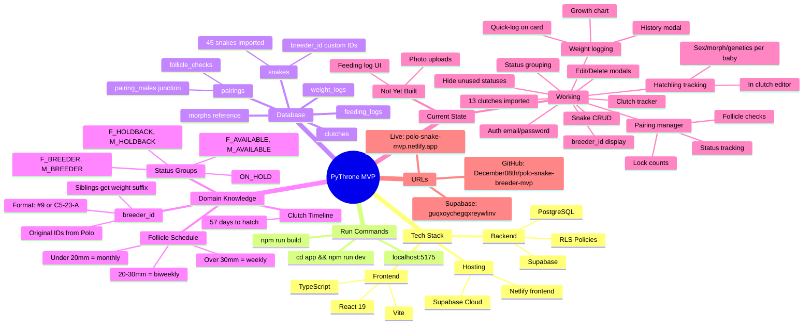

# PyThrone MVP - Project Context

## Mindmap



---

## Quick Reference

| What | Value |
|------|-------|
| Run locally | `cd app && npm run dev` |
| Local URL | http://localhost:5175 |
| Live URL | https://polo-snake-mvp.netlify.app |
| Supabase project | guqxoychegqxreywfinv |
| Package manager | npm |
| .env location | `app/.env` |

---

## Plan Feedback (Polo Review)

Before building new features, create a **Plan Feedback form** for Polo to review and approve the design.

### When to Suggest
- About to build a new feature (Weight Logging, Pairing Manager, etc.)
- Making significant changes to existing features
- Requirements seem ambiguous or have multiple approaches

### How It Works
1. Create HTML form in `app/public/` with feature details (user-friendly, not technical)
2. Use Netlify Forms for submission (`data-netlify="true"`)
3. Include `feedback-styles.css` for consistent styling
4. Deploy and send URL to Polo
5. Review his feedback before building

### Existing Forms
- `/pairing-feedback.html` - Pairing Manager review (approved, implemented)

---

## ⚠️ Running Admin Scripts (Bypass RLS)

**The Supabase CLI cannot execute SQL directly.** To run admin operations that bypass Row Level Security (RLS), use Node.js scripts with the **service role key**.

### Setup (one-time)
1. Get service key from: https://supabase.com/dashboard/project/guqxoychegqxreywfinv/settings/api
2. Add to `app/.env`:
   ```
   SUPABASE_URL=https://guqxoychegqxreywfinv.supabase.co
   SUPABASE_SERVICE_KEY=eyJ...your-service-key...
   ```

### Available Scripts
```bash
cd app

# Transfer snakes to a user account
node --env-file=.env transfer-snakes-to-user.js poloyaux@gmail.com

# Update breeder IDs on snakes
node --env-file=.env update-breeder-ids.js

# Import clutches (already run - 13 clutches imported)
node --env-file=.env import-clutches.js
```

### Creating New Admin Scripts
Use `createClient(url, serviceKey)` from `@supabase/supabase-js`. The service key bypasses RLS policies.

---

## Current State (04 Feb 2026)

### Done
- User auth (email/password, confirmation flow)
- Per-user data isolation (RLS)
- Snake collection with status grouping (7 groups, sorted by weight)
- Add/Edit/Delete snake functionality
- breeder_id field added - displays Polo's original IDs
- All 45 snakes have breeder_ids populated
- Siblings distinguished by weight suffix (e.g., "#65 C15-25-H (70g)")
- **Polo's account created** (poloyaux@gmail.com)
- **45 snakes transferred to Polo's account**
- **Clutch Tracker** - Incubator section with countdown, add/edit/delete clutches
- **13 historical clutches imported** (C5-23 through C17-25)
- **Hide Unused Statuses** - gear icon in collection header, localStorage persistence
- **Status groups collapsed by default** - click to expand
- **Supabase Site URL fixed** - confirmation emails now use production URL
- **Pairing Manager** - organize by female, track lock counts per male, follicle checks, key dates (Ovi, PLS), status flow (Active → Ovulated → Laid → Complete)
- **Weight Logging** - quick-log from SnakeCard, full history modal with growth chart (recharts), auto-updates snake.weight_grams, recent weights visible on card
- **Hatchling Tracking** - record sex, morph, genetics for each baby in clutch editor; babies stored as snake records linked via clutch_id

### Next Priorities
1. **Feeding Log** - refusals, days since meal
2. **Photo uploads**

---

## Domain Knowledge

### breeder_id Convention
Polo's original snake IDs from his spreadsheet. Format varies:
- Simple: `#9`, `#65`
- Clutch-based: `C5-23-A` (Clutch 5, 2023, letter A)
- Siblings with same breeder_id get weight suffix to distinguish

### Status Groups
| Status | Meaning |
|--------|---------|
| F_BREEDER | Female breeder |
| M_BREEDER | Male breeder |
| F_HOLDBACK | Female kept for future breeding |
| M_HOLDBACK | Male kept for future breeding |
| F_AVAILABLE | Female for sale |
| M_AVAILABLE | Male for sale |
| ON_HOLD | Reserved by buyer |

### Follicle Check Schedule
| Size | Frequency |
|------|-----------|
| < 20mm | Monthly |
| 20-30mm | Every 2 weeks |
| > 30mm | Weekly until ovulation |

### Clutch Timeline
- 57 days from lay date to expected hatch
- Track: fertile, slug, kink counts

---

## Key Files

| Purpose | Path |
|---------|------|
| Main app | `app/src/App.tsx` |
| Types | `app/src/types/database.ts` |
| Supabase client | `app/src/lib/supabase.ts` |
| Auth context | `app/src/contexts/AuthContext.tsx` |
| Components | `app/src/components/` |
| Weight logging | `app/src/components/WeightLogModal.tsx`, `WeightChart.tsx`, `QuickWeightLog.tsx` |
| Migrations | `supabase/migrations/` |
| Requirements | `REQUIREMENTS.md` |
| Schema docs | `SCHEMA.md` |

---

## Credentials & Access

| Service | Details |
|---------|---------|
| Supabase | Project `guqxoychegqxreywfinv` |
| Supabase Dashboard | https://supabase.com/dashboard/project/guqxoychegqxreywfinv |
| Netlify | Site `polo-snake-mvp` |
| GitHub | December08th/polo-snake-breeder-mvp |

---

## Supabase CLI

```bash
# Link to project (one-time)
npx supabase link --project-ref guqxoychegqxreywfinv

# Push migrations
npx supabase db push
```

Note: Docker Desktop needed for local Supabase, but cloud works without it.
