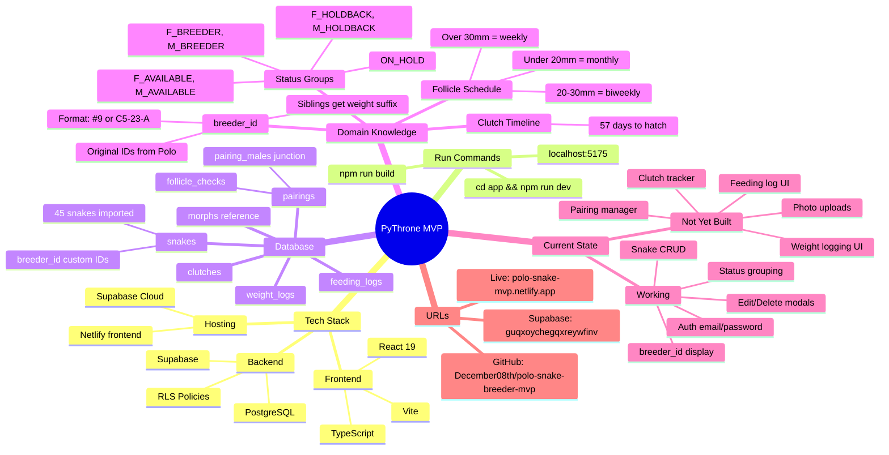

# PyThrone MVP - Project Context

## Mindmap



---

## Quick Reference

| What | Value |
|------|-------|
| Run locally | `cd app && npm run dev` |
| Local URL | http://localhost:5175 |
| Live URL | https://polo-snake-mvp.netlify.app |
| Supabase project | guqxoychegqxreywfinv |
| Package manager | npm |
| .env location | `app/.env` |

---

## Current State (01 Feb 2026)

### Done
- User auth (email/password, confirmation flow)
- Per-user data isolation (RLS)
- Snake collection with status grouping (7 groups, sorted by weight)
- Add/Edit/Delete snake functionality
- breeder_id field added - displays Polo's original IDs
- All 45 snakes have breeder_ids populated
- Siblings distinguished by weight suffix (e.g., "#65 C15-25-H (70g)")

### Next Priorities
1. **Weight Logging** - form + history chart per snake
2. **Feeding Log** - refusals, days since meal
3. **Pairing Manager** - follicle tracking, locks, PLS dates
4. **Clutch Tracker** - egg counts, hatch countdown

---

## Domain Knowledge

### breeder_id Convention
Polo's original snake IDs from his spreadsheet. Format varies:
- Simple: `#9`, `#65`
- Clutch-based: `C5-23-A` (Clutch 5, 2023, letter A)
- Siblings with same breeder_id get weight suffix to distinguish

### Status Groups
| Status | Meaning |
|--------|---------|
| F_BREEDER | Female breeder |
| M_BREEDER | Male breeder |
| F_HOLDBACK | Female kept for future breeding |
| M_HOLDBACK | Male kept for future breeding |
| F_AVAILABLE | Female for sale |
| M_AVAILABLE | Male for sale |
| ON_HOLD | Reserved by buyer |

### Follicle Check Schedule
| Size | Frequency |
|------|-----------|
| < 20mm | Monthly |
| 20-30mm | Every 2 weeks |
| > 30mm | Weekly until ovulation |

### Clutch Timeline
- 57 days from lay date to expected hatch
- Track: fertile, slug, kink counts

---

## Key Files

| Purpose | Path |
|---------|------|
| Main app | `app/src/App.tsx` |
| Types | `app/src/types/database.ts` |
| Supabase client | `app/src/lib/supabase.ts` |
| Auth context | `app/src/contexts/AuthContext.tsx` |
| Components | `app/src/components/` |
| Migrations | `supabase/migrations/` |
| Requirements | `REQUIREMENTS.md` |
| Schema docs | `SCHEMA.md` |

---

## Credentials & Access

| Service | Details |
|---------|---------|
| Supabase | Project `guqxoychegqxreywfinv` |
| Supabase Dashboard | https://supabase.com/dashboard/project/guqxoychegqxreywfinv |
| Netlify | Site `polo-snake-mvp` |
| GitHub | December08th/polo-snake-breeder-mvp |

---

## Supabase CLI

```bash
# Link to project (one-time)
npx supabase link --project-ref guqxoychegqxreywfinv

# Push migrations
npx supabase db push
```

Note: Docker Desktop needed for local Supabase, but cloud works without it.
